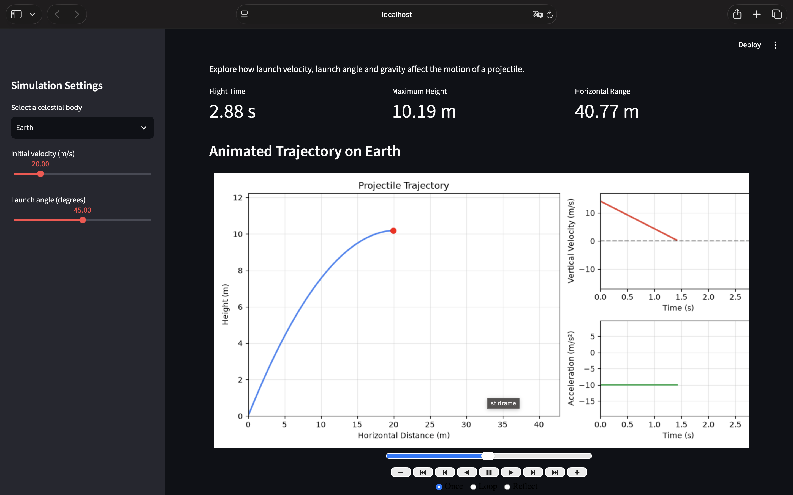

# Projectile Motion Simulator

An interactive Python application for exploring projectile motion under different gravitational conditions.

This project was originally developed in 2024 as a high-school physics visualisation project. It was redesigned in 2026 with a modular structure, an interactive web interface and additional simulation features.

## Application Preview

## Features

- Calculate a projectile's trajectory
- Adjust launch velocity and launch angle
- Simulate gravity on Earth, the Moon and Mars
- Display flight time, maximum height and horizontal range
- Visualise vertical velocity and acceleration
- View the generated simulation data
- Export simulation results as a CSV file

## Technologies

- Python
- NumPy
- Pandas
- Matplotlib
- Streamlit
